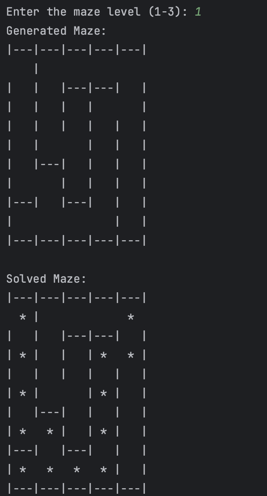
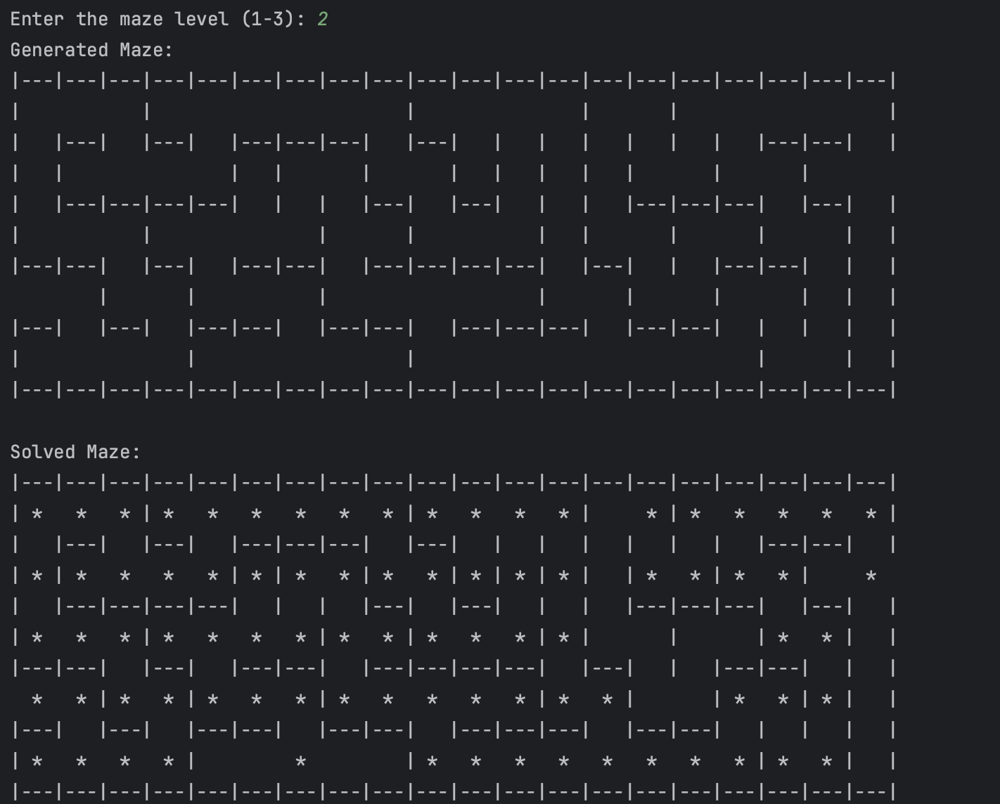

# Maze Solver - An application to generate and solve mazes.




## Description

> The Maze Solver is a C++ application designed to generate mazes based on varying
> levels of difficulty and solve them using a specific algorithm.
> This project serves as an educational tool for understanding maze generation and
> solving algorithms, while also showcasing fundamental C++ programming concepts
> such as classes, memory management, and data structures (i.e., stack, queue.

## Features

- Maze generation based on user-defined levels (1-3).
- Printing the generated maze to the console.
- Solving the maze using a specific algorithm.

## How to Install and Run the Project

- Clone the repository to your local machine.
  - `git clone https://github.com/curtiskokuloku/Maze.git`
- Navigate to the project directory.
  - `cd Maze`
- Compile the C++ source files using a C++ compiler (e.g., g++).
  - `g++ main.cpp -o main`
- Run the compiled executable
  - `./main`

## How to Use the Project

> Once you run the project, follow the on-screen instructions to generate a maze based
> on your chosen level (1-3).
> After generating the maze, you can view it on the console and proceed to solve
> it using the implemented algorithm.

Example

```bash
Enter the maze level (1-3):
```

## Credits

> Developed by Curtis Kin Kokuloku
---
03/2022
